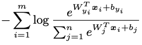
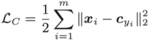
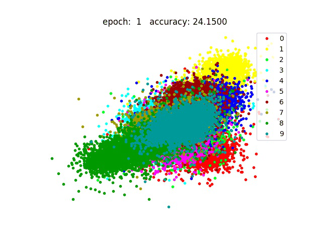
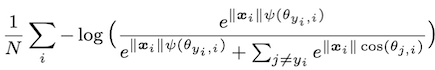
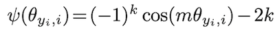
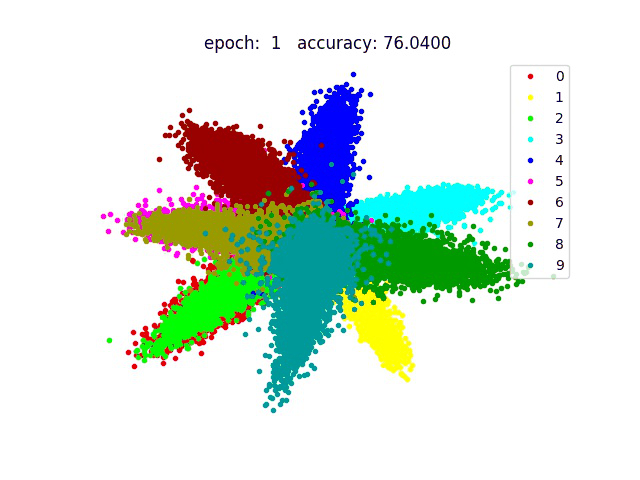
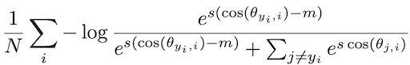
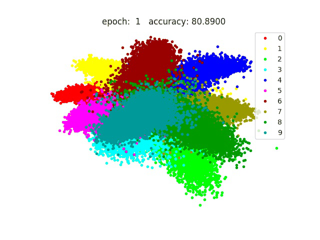
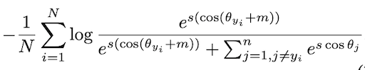
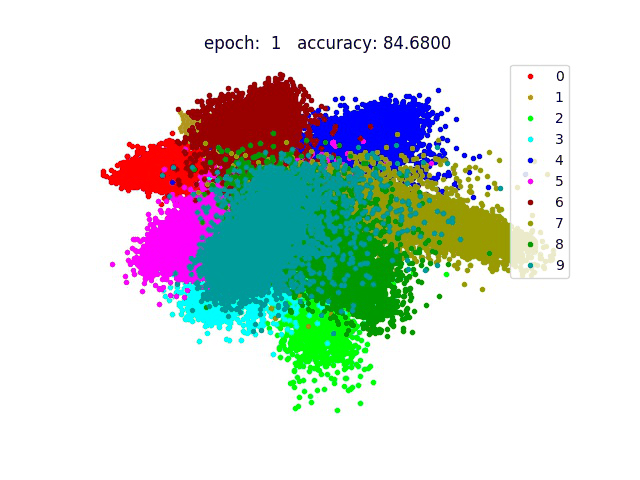

|Loss|Formula|Embedding Viz|Test Accuracy(30 epoch)|
|----|----|----|----------|
|SoftmaxLoss|||97.71|
|[CenterLoss-ECCV16](https://ydwen.github.io/papers/WenECCV16.pdf)|SoftmaxLoss + ||97.22|
|[SphereFace-CVPR17](https://arxiv.org/abs/1704.08063)|||98.44|
|[CosFace-CVPR18](https://arxiv.org/abs/1801.09414)|||98.35|
|[ArcFace-CVPR19](https://arxiv.org/abs/1801.07698)|||98.69|

# Train
```
python3 main.py --loss softmax_loss/sphere_face_loss/center_loss/cos_face_loss/arc_face_loss
```
